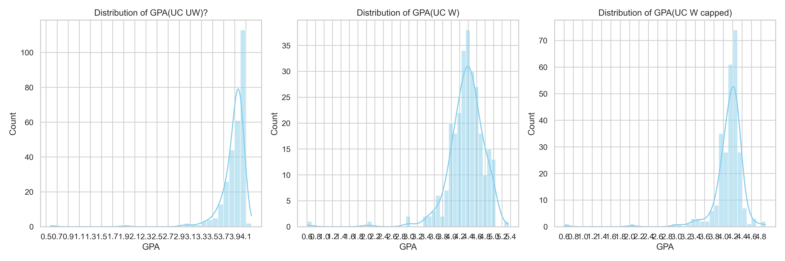
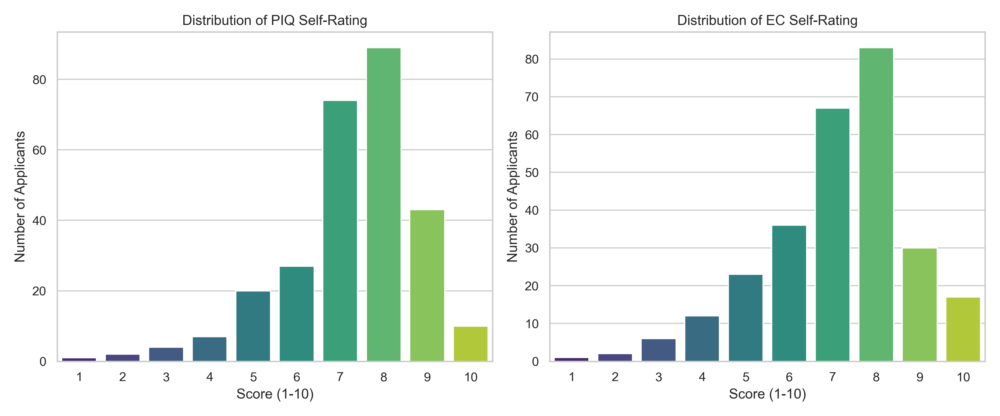
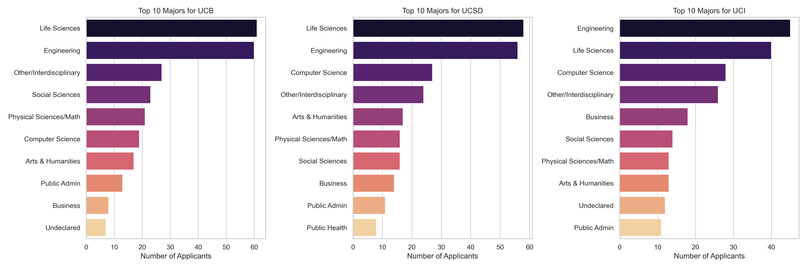

# UC Portal Signal AP Statistics Analysis

This project studies whether informal UC applicant portal signals are statistically aligned with applicant profile strength and with an AP Statistics-style expected-admission model.

The project does not claim that portal behavior causes admission outcomes or that any portal state is an official decision. The purpose is narrower: quantify whether observed portal states behave like noisy admission signals in this self-reported sample.

## Project Structure

```text
.
|-- data/
|   |-- processed/
|   |   |-- uc_application_data_cleaned.csv
|   |   `-- uc_applications_ai_major_categories.csv
|   `-- raw_public_gpa_bins/
|       |-- uc_berkeley_2025_applicant_gpa_bins.csv
|       |-- uc_irvine_2025_applicant_gpa_bins.csv
|       `-- uc_san_diego_2025_applicant_gpa_bins.csv
|-- outputs/
|   |-- figures/
|   |   |-- gpa_distributions_micro_bins.png
|   |   |-- piq_ec_self_rating_distributions.png
|   |   `-- top_major_categories_by_campus.png
|   |-- logs/
|   |   `-- analysis_results.txt
|   `-- scored_probabilities/
|       |-- uc_berkeley_apstats_expected_probabilities.csv
|       |-- uc_irvine_apstats_expected_probabilities.csv
|       `-- uc_san_diego_apstats_expected_probabilities.csv
|-- src/
|   |-- 01_clean_application_data.py
|   |-- 02_categorize_majors.py
|   |-- 03_describe_sample.py
|   |-- 04_compare_portal_signals.py
|   `-- 05_apstats_expected_admits.py
`-- README.md
```

File naming convention:

- `data/raw_public_gpa_bins/`: external public GPA-bin inputs used by the AP Stats model.
- `data/processed/`: cleaned applicant-level sample data.
- `src/`: numbered scripts in execution order.
- `outputs/figures/`: generated visual summaries.
- `outputs/scored_probabilities/`: applicant-level expected probabilities from the AP Stats model.
- `outputs/logs/`: captured text output from analysis runs.

## Research Questions

1. Do applicants with a favorable portal state have stronger GPA, PIQ, or EC profiles than applicants with an unfavorable portal state?
2. If admissions are modeled using public GPA-bin distributions and major-category admit-rate assumptions, how close are expected admits to the observed favorable portal counts?
3. For UCI, how accurate is the login-related portal signal in a manually checked outcome subset?

## Visual Summary

### GPA Distributions



This figure shows the distribution of UC unweighted GPA, UC weighted GPA, and UC weighted capped GPA in the cleaned applicant sample. It is useful for checking sample skew before interpreting portal-signal results. The sample is concentrated at the high end of the GPA range, which is expected for a self-selected UC applicant discussion sample but limits generalization to the full applicant pool.

### PIQ and EC Self-Ratings



This figure shows self-rated PIQ and extracurricular strength on a 1-10 scale. These variables are subjective and should not be treated as official admissions variables. In this project, they are mainly used as descriptive covariates and as matching controls in the propensity-score comparison.

### Major Categories by Campus



This figure shows the top AI-categorized major groups by campus. The sample is concentrated in STEM and life-science categories, so the analysis is most informative for this applicant mix and less representative of humanities, arts, and less common major categories.

## Data Sources

### Applicant Sample

Primary cleaned file:

- `data/processed/uc_applications_ai_major_categories.csv`

Sample summary:

| Variable | n | Mean | Median | SD | Min | Max |
|---|---:|---:|---:|---:|---:|---:|
| UC unweighted GPA | 277 | 3.865 | 3.940 | 0.287 | 0.58 | 4.20 |
| UC weighted GPA | 272 | 4.352 | 4.400 | 0.448 | 0.61 | 5.35 |
| UC weighted capped GPA | 268 | 4.118 | 4.180 | 0.348 | 0.61 | 4.90 |
| PIQ self-rating | 277 | 7.307 | 8.000 | 1.529 | 1 | 10 |
| EC self-rating | 277 | 7.130 | 7.000 | 1.670 | 1 | 10 |

The sample is self-reported. It is not a random sample of all UC applicants.

### Public GPA-Bin Inputs

The AP Stats model uses 2025 public applicant GPA-bin files:

- `data/raw_public_gpa_bins/uc_berkeley_2025_applicant_gpa_bins.csv`
- `data/raw_public_gpa_bins/uc_san_diego_2025_applicant_gpa_bins.csv`
- `data/raw_public_gpa_bins/uc_irvine_2025_applicant_gpa_bins.csv`

These files contain grouped HS weighted capped GPA counts. Since the data are binned, the model approximates the underlying applicant GPA distribution rather than observing it directly.

## Portal Signal Definitions

| Campus | Portal field | Favorable signal | Unfavorable signal | Excluded from comparison |
|---|---|---:|---:|---:|
| UC Berkeley | `Berkeley id or email?` | `Id` | `Email` | `Didn't Apply` |
| UC San Diego | `Is your UCSD #3 prestige banner there?` | `No` | `Yes` | `Didn't Apply` |
| UC Irvine | `Can you log in to the UCI link?` | `Yes` | `No` | `Didn't Apply` |

Observed counts:

| Campus | Favorable n | Unfavorable n | Did not apply n |
|---|---:|---:|---:|
| UC Berkeley | 176 | 67 | 34 |
| UC San Diego | 142 | 106 | 29 |
| UC Irvine | 116 | 86 | 75 |

These definitions reflect the working hypotheses used in the analysis. They should not be interpreted as official UC definitions.

## Methodology

### 1. Descriptive Sample Analysis

Script:

```bash
python src/03_describe_sample.py
```

This script summarizes GPA, PIQ, EC, and major-category distributions. It also generates:

- `outputs/figures/gpa_distributions_micro_bins.png`
- `outputs/figures/piq_ec_self_rating_distributions.png`
- `outputs/figures/top_major_categories_by_campus.png`

Purpose:

- Establish whether the sample is academically strong or skewed.
- Identify major-category concentration.
- Provide context before interpreting portal-signal comparisons.

### 2. Favorable vs Unfavorable Portal Group Comparison

Script:

```bash
python src/04_compare_portal_signals.py
```

For each campus, the script compares favorable and unfavorable portal groups on:

- UC unweighted GPA
- UC weighted GPA
- PIQ self-rating
- EC self-rating

Reported statistics:

- Mean difference: `mean(favorable) - mean(unfavorable)`
- Welch two-sample t-test p-value
- Cohen's d
- Simulation-based probability that the favorable-group mean is larger
- Propensity-score-matched GPA difference using PIQ and EC as matching covariates

Interpretation rules:

- A positive GPA difference means the favorable portal group has higher average GPA.
- A low p-value means the observed mean difference is less compatible with a zero-difference null model.
- Cohen's d measures standardized effect size; values around 0.2 are small, around 0.5 are moderate.
- The simulation probability is descriptive and depends on normal approximation of mean uncertainty.
- PSM adjustment is not causal; it only checks whether GPA differences persist after balancing on two self-rated non-GPA variables.

### 3. AP Stats Expected-Admit Model

Script:

```bash
python src/05_apstats_expected_admits.py
```

The model estimates applicant-level admission probabilities using:

```text
P(Admit | GPA) = P(Admit) * P(GPA | Admit) / P(GPA)
```

Model components:

- `P(Admit)` is a broad campus-major-category admit-rate assumption.
- `P(GPA | Admit)` is approximated as a normal distribution inferred from admitted-student GPA Q1 and Q3.
- `P(GPA)` is approximated as a normal distribution fitted from public applicant GPA bins.
- Applicant GPA is represented by UC weighted capped GPA.
- Individual probabilities are capped at 0.85 because real admissions are holistic and should not be modeled as certain from GPA alone.

The model then sums applicant-level probabilities:

```text
Expected admits = sum(P_i(Admit | GPA_i, major_category_i))
```

This produces an expected-admit count for the sample, which is compared with the observed favorable portal count.

Important caveat:

The AP Stats model is a structured approximation, not a production admissions model. It intentionally uses limited public information so that the reasoning is transparent and reproducible.

## Results

### Favorable vs Unfavorable Portal Groups

| Campus | Metric | Favorable mean | Unfavorable mean | Difference | p-value | Cohen's d | P(favorable > unfavorable) | PSM diff |
|---|---|---:|---:|---:|---:|---:|---:|---:|
| UC Berkeley | GPA_UW | 3.899 | 3.828 | +0.071 | 0.1880 | 0.267 | 90.8% | +0.101 |
| UC Berkeley | GPA_W | 4.426 | 4.241 | +0.185 | 0.0139 | 0.440 | 99.4% | +0.094 |
| UC Berkeley | PIQ | 7.449 | 7.493 | -0.044 | 0.8106 | -0.032 | 40.6% | N/A |
| UC Berkeley | EC | 7.318 | 7.239 | +0.079 | 0.7264 | 0.050 | 63.8% | N/A |
| UC San Diego | GPA_UW | 3.913 | 3.812 | +0.102 | 0.0143 | 0.354 | 99.3% | +0.063 |
| UC San Diego | GPA_W | 4.426 | 4.283 | +0.142 | 0.0201 | 0.321 | 99.1% | +0.133 |
| UC San Diego | PIQ | 7.359 | 7.368 | -0.009 | 0.9631 | -0.006 | 48.0% | N/A |
| UC San Diego | EC | 7.282 | 7.066 | +0.216 | 0.3174 | 0.132 | 84.2% | N/A |
| UC Irvine | GPA_UW | 3.900 | 3.805 | +0.095 | 0.0587 | 0.303 | 97.1% | +0.066 |
| UC Irvine | GPA_W | 4.405 | 4.283 | +0.123 | 0.0795 | 0.263 | 96.2% | +0.099 |
| UC Irvine | PIQ | 7.405 | 7.384 | +0.021 | 0.9128 | 0.015 | 54.2% | N/A |
| UC Irvine | EC | 7.190 | 7.035 | +0.155 | 0.5157 | 0.095 | 74.0% | N/A |

Main interpretation:

- Favorable portal groups have higher average GPA across all three campuses.
- UC Berkeley and UC San Diego show statistically clearer weighted-GPA separation.
- UCI shows the same direction, but with weaker statistical evidence in this sample.
- PIQ and EC differences are small and statistically weak, which suggests the portal signal is more aligned with GPA than with self-rated qualitative strength.

### AP Stats Expected vs Observed Favorable Signals

| Campus | Applicant-pool GPA mean | Applicant-pool GPA SD | Public GPA-bin N | Valid sample n | Expected admits | Favorable portal count | Difference | Ratio |
|---|---:|---:|---:|---:|---:|---:|---:|---:|
| UC Berkeley | 3.972 | 0.432 | 118,869 | 243 | 81.14 | 176 | +94.86 | 2.17x |
| UC San Diego | 3.901 | 0.495 | 129,373 | 248 | 136.04 | 142 | +5.96 | 1.04x |
| UC Irvine | 3.872 | 0.514 | 118,252 | 202 | 121.11 | 116 | -5.11 | 0.96x |

Main interpretation:

- UC San Diego and UC Irvine favorable portal counts are close to model expectations.
- UC Berkeley has far more `Id` observations than expected admits under this model.
- Therefore, the Berkeley `Id` state may be a weaker or broader signal than the UCSD and UCI favorable states, or the model may substantially underestimate Berkeley competitiveness in this sample.

### UCI Manual Outcome Check

Manual UCI classification counts:

| Category | Meaning | Count |
|---|---|---:|
| TP | Can log in and admitted | 75 |
| FP | Can log in but rejected/waitlisted | 22 |
| FN | Cannot log in but admitted | 20 |
| TN | Cannot log in and rejected/waitlisted | 33 |

Derived metrics:

| Metric | Formula | Value |
|---|---|---:|
| Precision | TP / (TP + FP) | 77.32% |
| Recall | TP / (TP + FN) | 78.95% |
| Specificity | TN / (TN + FP) | 60.00% |
| Accuracy | (TP + TN) / total | 72.00% |

Interpretation:

- The UCI login signal is informative in the manually checked subset.
- It is not definitive: both false positives and false negatives are material.
- Precision is stronger than specificity, meaning the signal is better at supporting positive cases than ruling out non-admits.

## Meaning of the Findings

The strongest evidence is not that portal signals perfectly predict decisions. They do not. The stronger conclusion is that favorable portal states are not randomly distributed with respect to applicant strength in this sample.

The GPA pattern matters because GPA is an admissions-relevant variable and is consistently higher in favorable portal groups. The AP Stats comparison matters because it asks a different question: not whether favorable groups are stronger, but whether the count of favorable signals is plausible under a transparent expected-admission model.

UCSD and UCI are the most internally consistent cases: favorable signal counts are close to expected admits, and favorable groups have stronger GPA profiles. Berkeley is different: the `Id` count is much larger than expected admits, so it should be treated as a broader and less selective indicator unless additional validation data show otherwise.

## Limitations

1. Selection bias: the sample is self-reported and likely overrepresents applicants who are highly engaged with portal tracking.
2. Measurement error: GPA, PIQ, EC, major, portal state, and outcome labels may contain reporting mistakes.
3. Major simplification: detailed majors are reduced into broad AI-categorized groups, which loses program-level selectivity.
4. Limited covariates: the AP Stats model does not include essays, course rigor, school context, awards, residency, first-generation status, special talents, or institutional priorities.
5. Approximate public data: GPA-bin files are grouped, so applicant-pool distributions are fitted from interval midpoints rather than raw observations.
6. Normality assumption: both applicant and admit GPA distributions are approximated as normal distributions, which may not hold well near GPA ceilings.
7. Probability cap: the 0.85 cap is a modeling judgment, not an empirical UC rule.
8. Multiple comparisons: many tests are reported, so isolated p-values should not be overinterpreted.
9. Signal definition uncertainty: favorable and unfavorable portal labels are hypothesis-driven and campus-specific.
10. No causal identification: differences between portal groups do not prove that portal state causes, determines, or officially reflects an admission decision.

## Reproducibility

Required Python packages:

- `pandas`
- `numpy`
- `scipy`
- `scikit-learn`
- `matplotlib`
- `seaborn`

Run the analysis from the repository root:

```bash
python src/03_describe_sample.py
python src/04_compare_portal_signals.py
python src/05_apstats_expected_admits.py
```

Optional upstream data-preparation scripts:

```bash
python src/01_clean_application_data.py
python src/02_categorize_majors.py
```

Expected outputs:

```text
outputs/figures/gpa_distributions_micro_bins.png
outputs/figures/piq_ec_self_rating_distributions.png
outputs/figures/top_major_categories_by_campus.png
outputs/scored_probabilities/uc_berkeley_apstats_expected_probabilities.csv
outputs/scored_probabilities/uc_san_diego_apstats_expected_probabilities.csv
outputs/scored_probabilities/uc_irvine_apstats_expected_probabilities.csv
```

## Bottom Line

Favorable UC portal states are associated with stronger GPA profiles in this sample, especially for Berkeley and UCSD weighted GPA. UCSD and UCI favorable counts are close to AP Stats model expectations, while Berkeley's `Id` count is much larger than expected and should be interpreted cautiously. The evidence supports portal signals as noisy, campus-specific indicators, not as official or deterministic admission outcomes.

---

# 中文版：UC Portal Signal AP Statistics Analysis

本项目研究 UC 申请者中流传的非正式 portal signal，也就是俗称的“portal astrology”，是否和申请者背景强度、以及一个 AP Statistics 风格的预期录取模型相一致。

本项目不声称 portal 状态会导致录取结果，也不声称任何 portal 状态等同于官方录取决定。更严谨地说，本项目只回答一个较窄的问题：在这个自愿填写的样本中，这些 portal 状态是否表现得像有噪声的录取相关信号。

## 项目结构

```text
.
|-- data/
|   |-- processed/
|   |   |-- uc_application_data_cleaned.csv
|   |   `-- uc_applications_ai_major_categories.csv
|   `-- raw_public_gpa_bins/
|       |-- uc_berkeley_2025_applicant_gpa_bins.csv
|       |-- uc_irvine_2025_applicant_gpa_bins.csv
|       `-- uc_san_diego_2025_applicant_gpa_bins.csv
|-- outputs/
|   |-- figures/
|   |   |-- gpa_distributions_micro_bins.png
|   |   |-- piq_ec_self_rating_distributions.png
|   |   `-- top_major_categories_by_campus.png
|   |-- logs/
|   |   `-- analysis_results.txt
|   `-- scored_probabilities/
|       |-- uc_berkeley_apstats_expected_probabilities.csv
|       |-- uc_irvine_apstats_expected_probabilities.csv
|       `-- uc_san_diego_apstats_expected_probabilities.csv
|-- src/
|   |-- 01_clean_application_data.py
|   |-- 02_categorize_majors.py
|   |-- 03_describe_sample.py
|   |-- 04_compare_portal_signals.py
|   `-- 05_apstats_expected_admits.py
`-- README.md
```

目录含义：

- `data/raw_public_gpa_bins/`：公开的 UC 申请者 GPA 分箱数据，用于 AP Stats 模型。
- `data/processed/`：清洗后的申请者样本数据。
- `src/`：按执行顺序编号的分析脚本。
- `outputs/figures/`：生成的描述性统计图。
- `outputs/scored_probabilities/`：AP Stats 模型输出的申请者级别预期录取概率。
- `outputs/logs/`：分析脚本的文本输出记录。

## 研究问题

1. 有 favorable portal signal 的申请者，是否在 GPA、PIQ、EC 上比 unfavorable signal 组更强？
2. 如果用公开 GPA 分布和专业大类录取率假设构建 AP Stats 模型，模型预期录取人数和 favorable portal count 是否接近？
3. 对 UCI 来说，login signal 在人工核验结果中的分类表现如何？

## 配图说明

### GPA 分布


这张图展示 UC unweighted GPA、UC weighted GPA、UC weighted capped GPA 的样本分布。可以看到样本集中在较高 GPA 区间。这说明样本本身偏强，也符合自愿参与 UC portal 讨论群体的特征。因此，后续结论不能直接推广到所有 UC 申请者。

### PIQ 与 EC 自评分布


这张图展示申请者对 PIQ 和课外活动的 1-10 分自评。需要注意，这两个变量是主观自评，不是 UC 官方评价指标。在本项目中，它们主要用于描述样本，以及在 PSM 分析中作为控制变量。

### 各校热门专业大类


这张图展示三所学校样本中最常见的 AI 归类专业大类。样本明显集中在 STEM 和生命科学方向，因此项目结论对这些方向的解释力更强，对文科、艺术、小众专业的代表性较弱。

## 数据来源

主要清洗样本：

- `data/processed/uc_applications_ai_major_categories.csv`

样本概况：

| 变量 | n | 均值 | 中位数 | 标准差 | 最小值 | 最大值 |
|---|---:|---:|---:|---:|---:|---:|
| UC unweighted GPA | 277 | 3.865 | 3.940 | 0.287 | 0.58 | 4.20 |
| UC weighted GPA | 272 | 4.352 | 4.400 | 0.448 | 0.61 | 5.35 |
| UC weighted capped GPA | 268 | 4.118 | 4.180 | 0.348 | 0.61 | 4.90 |
| PIQ 自评 | 277 | 7.307 | 8.000 | 1.529 | 1 | 10 |
| EC 自评 | 277 | 7.130 | 7.000 | 1.670 | 1 | 10 |

公开 GPA 分箱数据：

- `data/raw_public_gpa_bins/uc_berkeley_2025_applicant_gpa_bins.csv`
- `data/raw_public_gpa_bins/uc_san_diego_2025_applicant_gpa_bins.csv`
- `data/raw_public_gpa_bins/uc_irvine_2025_applicant_gpa_bins.csv`

这些文件是 HS weighted capped GPA 的分箱计数。由于不是原始个体级数据，模型只能从区间数据近似拟合总体 GPA 分布。

## Portal Signal 定义

| 学校 | Portal 字段 | Favorable signal | Unfavorable signal | 排除状态 |
|---|---|---:|---:|---:|
| UC Berkeley | `Berkeley id or email?` | `Id` | `Email` | `Didn't Apply` |
| UC San Diego | `Is your UCSD #3 prestige banner there?` | `No` | `Yes` | `Didn't Apply` |
| UC Irvine | `Can you log in to the UCI link?` | `Yes` | `No` | `Didn't Apply` |

观测计数：

| 学校 | Favorable n | Unfavorable n | Did not apply n |
|---|---:|---:|---:|
| UC Berkeley | 176 | 67 | 34 |
| UC San Diego | 142 | 106 | 29 |
| UC Irvine | 116 | 86 | 75 |

这些 favorable / unfavorable 定义是本项目的工作假设，不是 UC 官方定义。

## 方法论

### 1. 描述性样本分析

脚本：

```bash
python src/03_describe_sample.py
```

该脚本用于总结 GPA、PIQ、EC 和专业大类分布，并生成三张图。它的作用是先判断样本本身的结构和偏差，再解释后续 portal signal 的结果。

### 2. Favorable vs Unfavorable 组间比较

脚本：

```bash
python src/04_compare_portal_signals.py
```

该脚本对每个 campus 比较 favorable 组和 unfavorable 组在以下变量上的差异：

- UC unweighted GPA
- UC weighted GPA
- PIQ 自评
- EC 自评

报告指标包括：

- 均值差：`mean(favorable) - mean(unfavorable)`
- Welch two-sample t-test p-value
- Cohen's d 标准化效应量
- 模拟得到的 favorable 组均值更高的概率
- 以 PIQ 和 EC 为协变量的 propensity-score-matched GPA difference

解释原则：

- GPA 差值为正，说明 favorable 组平均 GPA 更高。
- p-value 较低，说明在“真实均值无差异”的零假设下，观察到该差异的兼容性较弱。
- Cohen's d 衡量效应量大小，约 0.2 可视为小效应，约 0.5 可视为中等效应。
- 模拟概率是描述性结果，依赖于均值不确定性的正态近似。
- PSM 不是因果识别，只是在 PIQ 和 EC 两个自评变量上做平衡后，观察 GPA 差异是否仍存在。

### 3. AP Stats Expected-Admit Model

脚本：

```bash
python src/05_apstats_expected_admits.py
```

模型使用贝叶斯公式估计每个申请者的预期录取概率：

```text
P(Admit | GPA) = P(Admit) * P(GPA | Admit) / P(GPA)
```

模型组成：

- `P(Admit)`：来自 campus-major 大类的录取率假设。
- `P(GPA | Admit)`：用录取者 GPA Q1 和 Q3 反推正态分布。
- `P(GPA)`：用公开申请者 GPA 分箱数据拟合申请池 GPA 分布。
- 个体 GPA 使用 UC weighted capped GPA。
- 个体概率上限设为 0.85，因为真实 UC 录取是 holistic review，不能由 GPA 单一变量推出 100% 确定性。

最后对所有申请者的概率求和：

```text
Expected admits = sum(P_i(Admit | GPA_i, major_category_i))
```

这个 expected admits 用来和 favorable portal count 对比。

## 主要结果

### Favorable vs Unfavorable Portal Groups

| 学校 | 指标 | Favorable 均值 | Unfavorable 均值 | 差值 | p-value | Cohen's d | P(favorable > unfavorable) | PSM diff |
|---|---|---:|---:|---:|---:|---:|---:|---:|
| UC Berkeley | GPA_UW | 3.899 | 3.828 | +0.071 | 0.1880 | 0.267 | 90.8% | +0.101 |
| UC Berkeley | GPA_W | 4.426 | 4.241 | +0.185 | 0.0139 | 0.440 | 99.4% | +0.094 |
| UC Berkeley | PIQ | 7.449 | 7.493 | -0.044 | 0.8106 | -0.032 | 40.6% | N/A |
| UC Berkeley | EC | 7.318 | 7.239 | +0.079 | 0.7264 | 0.050 | 63.8% | N/A |
| UC San Diego | GPA_UW | 3.913 | 3.812 | +0.102 | 0.0143 | 0.354 | 99.3% | +0.063 |
| UC San Diego | GPA_W | 4.426 | 4.283 | +0.142 | 0.0201 | 0.321 | 99.1% | +0.133 |
| UC San Diego | PIQ | 7.359 | 7.368 | -0.009 | 0.9631 | -0.006 | 48.0% | N/A |
| UC San Diego | EC | 7.282 | 7.066 | +0.216 | 0.3174 | 0.132 | 84.2% | N/A |
| UC Irvine | GPA_UW | 3.900 | 3.805 | +0.095 | 0.0587 | 0.303 | 97.1% | +0.066 |
| UC Irvine | GPA_W | 4.405 | 4.283 | +0.123 | 0.0795 | 0.263 | 96.2% | +0.099 |
| UC Irvine | PIQ | 7.405 | 7.384 | +0.021 | 0.9128 | 0.015 | 54.2% | N/A |
| UC Irvine | EC | 7.190 | 7.035 | +0.155 | 0.5157 | 0.095 | 74.0% | N/A |

解释：

- 三所学校的 favorable 组 GPA 均值都更高。
- Berkeley 和 UCSD 的 weighted GPA 差异更清晰，p-value 低于常见 0.05 阈值。
- UCI 方向一致，但统计证据相对弱。
- PIQ 和 EC 差异较小，说明 portal signal 在本样本中更像是和 GPA 相关，而不是和主观自评的软实力强相关。

### AP Stats Expected vs Observed Favorable Signals

| 学校 | 申请池 GPA 均值 | 申请池 GPA SD | 公开 GPA-bin N | 有效样本 n | Expected admits | Favorable portal count | 差值 | Ratio |
|---|---:|---:|---:|---:|---:|---:|---:|---:|
| UC Berkeley | 3.972 | 0.432 | 118,869 | 243 | 81.14 | 176 | +94.86 | 2.17x |
| UC San Diego | 3.901 | 0.495 | 129,373 | 248 | 136.04 | 142 | +5.96 | 1.04x |
| UC Irvine | 3.872 | 0.514 | 118,252 | 202 | 121.11 | 116 | -5.11 | 0.96x |

解释：

- UCSD 和 UCI 的 favorable portal count 与 AP Stats 模型预期非常接近。
- Berkeley 的 `Id` 数量明显高于模型预期录取人数。
- 因此 Berkeley `Id` 更可能是较宽泛、较不 selective 的信号；或者模型低估了该样本中 Berkeley 申请者的竞争力；也可能二者同时存在。

### UCI 人工核验

| 类别 | 含义 | 数量 |
|---|---|---:|
| TP | 能登录且录取 | 75 |
| FP | 能登录但拒绝或 waitlist | 22 |
| FN | 不能登录但录取 | 20 |
| TN | 不能登录且拒绝或 waitlist | 33 |

| 指标 | 公式 | 数值 |
|---|---|---:|
| Precision | TP / (TP + FP) | 77.32% |
| Recall | TP / (TP + FN) | 78.95% |
| Specificity | TN / (TN + FP) | 60.00% |
| Accuracy | (TP + TN) / total | 72.00% |

解释：

- UCI login signal 在人工核验子样本中确实有信息量。
- 但它不是确定性规则，false positive 和 false negative 都不少。
- Precision 高于 specificity，说明该信号更适合支持“可能录取”的判断，而不适合用来排除录取。

## 结论意义

本项目最重要的结论不是“portal signal 可以完美预测录取”。它不能。更合理的结论是：在这个样本中，favorable portal states 并不是完全随机地分布在申请者中，而是与更高 GPA profile 有一定一致性。

GPA 结果有意义，是因为 GPA 是真实 UC 录取中相关的学术变量。AP Stats 模型对照有意义，是因为它不只比较强弱，还进一步问：favorable signal 的人数是否接近一个透明模型下的 expected admits。

UCSD 和 UCI 是内部一致性更强的两个案例：favorable count 接近 expected admits，且 favorable 组 GPA 更高。Berkeley 则不同，`Id` 数量远高于 expected admits，因此应该更谨慎地解释。

## 局限性

1. 样本是自愿填写，存在 selection bias。
2. GPA、PIQ、EC、专业、portal 状态、结果标签都可能有填报或清洗误差。
3. AI major categorization 把具体专业简化为大类，会损失专业级 selectivity 信息。
4. AP Stats 模型只用了 GPA 和专业大类，没有包含 essay、课程难度、学校背景、奖项、身份背景、特殊才能等变量。
5. 公开 GPA 数据是分箱数据，不是原始个体数据。
6. 正态分布假设在 GPA 天花板附近可能不完全成立。
7. 0.85 probability cap 是建模判断，不是 UC 官方规则。
8. 本项目报告了多组统计检验，单个 p-value 不应被过度解读。
9. Favorable / unfavorable signal 的定义是基于传闻和样本假设，不是官方定义。
10. 这是观察性分析，不提供因果识别。

## 如何复现

需要的 Python 包：

- `pandas`
- `numpy`
- `scipy`
- `scikit-learn`
- `matplotlib`
- `seaborn`

从仓库根目录运行：

```bash
python src/03_describe_sample.py
python src/04_compare_portal_signals.py
python src/05_apstats_expected_admits.py
```

如需从上游清洗步骤重新生成数据：

```bash
python src/01_clean_application_data.py
python src/02_categorize_majors.py
```

## 中文结论

在这个样本中，favorable UC portal states 与更强的 GPA profile 有一致关系，尤其体现在 Berkeley 和 UCSD 的 weighted GPA 上。UCSD 和 UCI 的 favorable count 与 AP Stats 模型预期接近；Berkeley 的 `Id` count 明显高于模型预期，因此需要谨慎解释。整体证据支持 portal signal 是有噪声、分学校而异的弱到中等信息信号，而不是官方录取结果或确定性预测规则。-Billy
